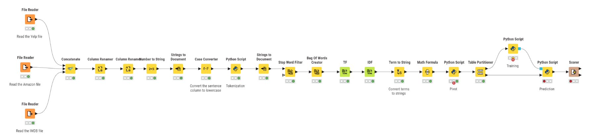

# Binary Sentiment Classification

This project focuses on classifying sentiments from various text sources using a binary classification approach. The main goal is to accurately determine whether the sentiment expressed in a given text is positive or negative using low-code tool Knime.

## Pipeline Overview

## Data Sources
The dataset used for training and testing includes:
- Amazon reviews
- IMDB reviews
- Yelp reviews
